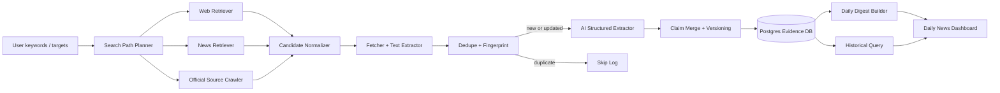

# VC Company Monitor MVP Implementation Spec

> Goal: build a reusable company-monitoring demo for VC workflows. The system accepts user keywords / target companies, designs search paths, retrieves public information, extracts structured claims with AI assistance, fingerprints and deduplicates records, stores versioned evidence, and renders daily news plus historical database views.

---

## 0. Product definition

### MVP scope

The MVP is not a generic search engine. It is a **research monitor runtime**:

```text
user keywords / target list
  -> canonical monitor request
  -> search path plan
  -> retrieval candidates
  -> document extraction
  -> evidence / claim extraction
  -> fingerprint + dedupe + versioning
  -> storage
  -> daily digest + historical query dashboard
```

### Primary users

- VC analyst monitoring target startups, portfolio companies, competitors, sectors, or investment themes.
- Founder / strategy team monitoring market signals.
- Internal demo users validating the broader AI data-analysis platform.

### What counts as a “signal”

For VC use, the important unit is not an article. The important unit is a **claim/event**:

```text
Company X raised $30M Series B from Y on date D.
Company X launched product P.
Company X hired / lost executive E.
Company X signed customer / partner C.
Company X faces lawsuit / regulation / shutdown / data breach.
Company X shows traction proxy: hiring surge, GitHub growth, web traffic, app ranking, etc.
```

---

## 1. Key design principle

### Treat the monitor as: DB first, KB on top, agents around it

- Database stores raw records, versions, fingerprints, evidence items, run logs.
- Knowledge layer organizes entities, events, relations, summaries, hypotheses.
- Agents operate around these typed objects, rather than freely chatting over unstructured search results.

### Keep evidence and inference separate

Each article may produce multiple evidence items and claims. Store them separately:

```text
Document: source page / article
Evidence item: quoted or paraphrased support from a document
Claim: normalized business event / proposition extracted from evidence
Inference: system assessment of importance, risk, novelty, impact, confidence
```

---

## 2. Modular architecture

```text
vc_monitor/
  apps/
    api/                         # FastAPI backend
    dashboard/                   # Next.js or Streamlit MVP
    worker/                      # scheduler + async jobs
  packages/
    contracts/                   # Pydantic models / JSON schemas
    domain_pack_vc/              # search templates, event taxonomy, scoring rules
    search_planner/              # keyword -> search plan
    retrievers/                  # Tavily / Exa / NewsAPI / SEC / Crunchbase adapters
    fetcher/                     # URL fetch, browser fallback, content extraction
    normalizer/                  # URL canonicalization, text normalization
    fingerprinter/               # URL/doc/claim fingerprints, near duplicate detection
    extractor/                   # AI + rule-based extraction
    analyzer/                    # signal scoring, relevance, reliability, novelty
    storage/                     # database repositories
    digest/                      # daily digest builder
    observability/               # run logs, audit, metrics
  configs/
    source_registry.yaml
    event_taxonomy.yaml
    query_templates.yaml
    reliability_rules.yaml
  tests/
```

### Recommended stack for MVP

- Backend: Python 3.12 + FastAPI.
- Worker: Celery/RQ/Temporal Lite, or simple APScheduler for first demo.
- Database: PostgreSQL; add pgvector only when semantic similarity is needed.
- Cache/queue: Redis.
- Frontend: Streamlit for fastest demo; Next.js + shadcn/ui + Recharts for polished demo.
- AI extraction: OpenAI / Anthropic / local model behind an `LLMClient` interface. Use structured JSON output.
- Retrieval: start with one general web API and one news API; add Crunchbase / SEC / custom source adapters later.

---

## 3. Main data contracts

### 3.1 Monitor request

```python
class MonitorRequest(BaseModel):
    request_id: str
    user_query: str
    targets: list[str] = []              # company names, sectors, people, funds
    domain: str = "vc_company_monitor"
    task_type: Literal["daily_monitor", "historical_query", "deep_dive"]
    time_window: dict                    # {"from": "2026-05-11", "to": "2026-05-12"}
    languages: list[str] = ["en"]
    geography: list[str] = []
    source_constraints: dict = {}        # include/exclude domains, paid data allowed, etc.
    privacy_mode: Literal["public_only", "internal_allowed"] = "public_only"
```

### 3.2 Search plan

```python
class SearchTask(BaseModel):
    task_id: str
    path_type: Literal[
        "entity_identity",
        "official_source",
        "funding_deal",
        "product_traction",
        "people_hiring",
        "customer_partner",
        "market_competition",
        "risk_regulatory",
        "financial_public",
        "technical_signal"
    ]
    query: str
    source_class: Literal["web", "news", "company_site", "database", "filing", "social_allowed"]
    priority: int
    freshness_days: int
    expected_event_types: list[str]
    inclusion_domains: list[str] = []
    exclusion_domains: list[str] = []
    max_results: int = 20
```

### 3.3 Document

```python
class DocumentRecord(BaseModel):
    doc_id: str
    canonical_url: str
    original_url: str
    title: str | None
    source_domain: str
    source_name: str | None
    published_at: datetime | None
    fetched_at: datetime
    author: str | None
    language: str | None
    raw_text: str
    normalized_text: str
    url_fingerprint: str
    content_fingerprint: str
    simhash: str | None
    source_reliability: float
```

### 3.4 Evidence item

```python
class EvidenceItem(BaseModel):
    evidence_id: str
    doc_id: str
    claim_id: str | None
    quote_or_span: str
    claim_text: str
    source_type: Literal["official", "news", "database", "filing", "blog", "social_allowed", "other"]
    evidence_date: date | None
    relevance: float
    reliability: float
    stance: Literal["support", "refute", "context"]
```

### 3.5 Claim / event

```python
class CompanyClaim(BaseModel):
    claim_id: str
    canonical_entity_id: str | None
    company_name: str
    event_type: Literal[
        "funding",
        "mna",
        "product_launch",
        "partnership",
        "customer_win",
        "hiring",
        "layoff",
        "executive_change",
        "regulatory",
        "lawsuit",
        "security_incident",
        "financial_metric",
        "market_signal",
        "technical_signal",
        "other"
    ]
    event_date: date | None
    normalized_claim: str
    structured_fields: dict             # amount, round, investors, product, customer, geography, etc.
    claim_fingerprint: str
    novelty_status: Literal["new", "known", "updated", "duplicate", "conflicting"]
    confidence: float
    importance_score: float
    vc_impact: Literal["opportunity", "risk", "neutral", "unknown"]
```

---

## 4. Search path design

A good monitor should not generate only one query from the user keyword. It should generate multiple **search paths**, each optimized for a different evidence class.

### 4.1 Input normalization

From user input:

```text
"Monitor AI infra startups, especially LangChain and vector database companies"
```

Produce:

```json
{
  "targets": ["LangChain", "vector database companies", "AI infrastructure startups"],
  "aliases": {
    "LangChain": ["LangChain", "LangChain Inc", "LangChain AI"],
    "vector database companies": ["Pinecone", "Weaviate", "Qdrant", "Milvus", "Chroma"]
  },
  "themes": ["AI infrastructure", "LLM tooling", "RAG", "vector database"],
  "time_window": "last_24h_for_daily / last_7d_for_backfill"
}
```

### 4.2 Search path taxonomy

| Path | Purpose | Example query pattern | Priority |
|---|---|---|---|
| Entity identity | Resolve company, aliases, official domain | `"{company}" founder OR headquarters OR official` | High for first run |
| Official source | Company blog, press, changelog, pricing, careers | `site:{domain} ({company} OR blog OR press OR announcement)` | High |
| Funding / deal | Financing, investors, valuation, M&A | `"{company}" (raised OR funding OR "Series A" OR acquisition OR acquired)` | High |
| Product / traction | Launches, adoption, customers, case studies | `"{company}" (launch OR product OR customer OR "case study")` | High |
| People / hiring | founder, exec, headcount, layoffs | `"{company}" (hiring OR careers OR "VP" OR founder OR layoffs)` | Medium |
| Customer / partner | enterprise traction and distribution | `"{company}" (partner OR partnership OR customer OR integration)` | Medium |
| Market / competition | landscape and substitutes | `"{theme}" startup competitors funding market map` | Medium |
| Risk / regulatory | lawsuits, breach, sanctions, FDA/SEC issues | `"{company}" (lawsuit OR breach OR investigation OR regulatory)` | High for risk monitor |
| Public financial / filings | S-1, 10-K, 8-K, proxy, public comps | `"{company}" site:sec.gov OR S-1 OR 10-K` | Conditional |
| Technical signal | GitHub, docs, release notes, patents | `"{company}" GitHub release notes API docs patent` | Conditional |

### 4.3 Query generation logic

Use deterministic templates first, then AI only to expand ambiguous concepts.

```python
def generate_search_plan(request, target_profile, taxonomy):
    tasks = []
    for target in target_profile.targets:
        aliases = target_profile.aliases[target]
        for path in taxonomy.enabled_paths:
            q = render_template(path.query_template, target=target, aliases=aliases)
            tasks.append(SearchTask(
                path_type=path.name,
                query=q,
                source_class=path.source_class,
                priority=path.priority,
                freshness_days=path.freshness_days,
                expected_event_types=path.event_types,
                max_results=path.max_results,
            ))
    return rank_and_budget(tasks)
```

### 4.4 Precision vs recall split

Each path should emit two query types:

1. **Precision query**: exact company name, exact event terms, restricted source/domain.
2. **Recall query**: broader theme/sector terms, fewer constraints, lower priority.

Example for a company target:

```text
Precision:
"LangChain" (funding OR "Series" OR raised OR investor) -tutorial -course

Recall:
("LLM app platform" OR "AI agent framework") (funding OR launch OR partnership)
```

### 4.5 Source reliability ranking

Suggested default reliability priors:

```yaml
official_company_press: 0.90
official_regulatory_filing: 0.95
major_business_news: 0.85
specialized_tech_news: 0.80
private_market_database: 0.85
company_blog: 0.80
personal_blog: 0.45
social_media_allowed: 0.35
unknown_scraped_site: 0.20
```

Reliability is not the same as relevance. A low-reliability source can still trigger a follow-up search, but should not drive high-confidence claims alone.

---

## 5. Retrieval module

### 5.1 Adapter interface

```python
class RetrieverAdapter(Protocol):
    name: str
    source_class: str

    async def search(self, task: SearchTask) -> list[SearchCandidate]:
        ...
```

### 5.2 Candidate record

```python
class SearchCandidate(BaseModel):
    task_id: str
    adapter_name: str
    title: str | None
    url: str
    snippet: str | None
    source_name: str | None
    published_at: datetime | None
    rank: int
    raw_response: dict
```

### 5.3 Start with these adapters

- General AI-oriented web search: Tavily or Exa.
- News discovery: NewsAPI or a similar news provider.
- Official source crawler: company domain allowlist + sitemap / RSS / blog / press pages.
- SEC EDGAR adapter: only for public companies or public filing events.
- Crunchbase adapter: optional paid private-market source.

Do not hard-code one provider. Keep adapters replaceable.

---

## 6. Fingerprint and deduplication strategy

### 6.1 Why multiple fingerprints are needed

A single hash is insufficient because duplicates appear at different levels:

- Same URL seen in multiple searches.
- Same article URL with tracking parameters.
- Same article reposted by multiple syndication sites.
- Same event reported by multiple different articles.
- Same article updated after publication.
- Same event with new amount/investor/date details.

### 6.2 Fingerprint layers

| Fingerprint | Formula | Purpose |
|---|---|---|
| `url_fingerprint` | hash(canonical_url_without_tracking) | exact URL dedupe |
| `content_fingerprint` | hash(normalized_title + normalized_text) | exact content dedupe |
| `simhash` / `minhash` | locality-sensitive hash of normalized text | near-duplicate doc detection |
| `entity_fingerprint` | hash(normalized company name + domain + aliases) | entity resolution |
| `claim_fingerprint` | hash(entity_id + event_type + event_date + normalized structured fields) | event/claim dedupe |
| `version_fingerprint` | hash(doc_id + extracted fields + content hash) | update detection |

### 6.3 Canonical URL normalization

Remove common tracking parameters:

```text
utm_source, utm_medium, utm_campaign, utm_term, utm_content,
fbclid, gclid, ref, source, icid
```

Normalize:

```text
lowercase scheme/host
strip trailing slash
resolve redirects
sort query params
remove fragments
```

### 6.4 Document dedupe logic

```python
def classify_document_candidate(candidate, fetched_doc):
    url_hit = db.find_by_url_fingerprint(fetched_doc.url_fingerprint)
    if url_hit and url_hit.content_fingerprint == fetched_doc.content_fingerprint:
        return "exact_duplicate"

    if url_hit and url_hit.content_fingerprint != fetched_doc.content_fingerprint:
        return "same_url_updated"

    content_hit = db.find_by_content_fingerprint(fetched_doc.content_fingerprint)
    if content_hit:
        return "syndicated_duplicate"

    near_hits = db.find_near_duplicate_by_simhash(fetched_doc.simhash, threshold=3)
    if near_hits:
        return "near_duplicate"

    return "new_document"
```

### 6.5 Claim dedupe logic

```python
def classify_claim(claim):
    existing = db.find_claim_by_fingerprint(claim.claim_fingerprint)
    if not existing:
        return "new"

    if existing.structured_fields == claim.structured_fields:
        return "duplicate"

    if is_more_complete(claim, existing) or is_newer(claim, existing):
        return "updated"

    if conflicts_with_existing(claim, existing):
        return "conflicting"

    return "known"
```

### 6.6 “Only analyze new information” rule

Run expensive AI extraction only when:

```text
new_document
same_url_updated
near_duplicate but source is higher reliability
existing claim has missing fields
candidate is from official / filing source and may verify an existing claim
```

Skip or lightly process:

```text
exact_duplicate
syndicated_duplicate from lower reliability source
near_duplicate with no new date / no new entities / no new source authority
```

---

## 7. AI-assisted extraction

### 7.1 AI should be used for structured extraction, not uncontrolled summarization

Use AI API for:

- Entity extraction: companies, investors, founders, products, customers, people.
- Claim extraction: event type, event date, amount, round, investor names, product names.
- Evidence span selection: the exact text supporting each claim.
- Importance scoring: why this matters to VC.
- Daily digest writing after claims are already validated.

Do not use AI for:

- URL dedupe.
- Basic timestamp parsing.
- Source reliability priors.
- Database merge decisions without deterministic checks.

### 7.2 Extraction prompt contract

System instruction:

```text
You are an information extraction engine for a VC company monitor.
Extract only claims supported by the provided text.
Do not infer facts that are not explicitly stated.
Return JSON matching the schema.
If a field is unknown, return null.
Always include the supporting evidence span.
```

Schema sketch:

```json
{
  "entities": [
    {"name": "", "type": "company|person|investor|product|customer|fund", "role": ""}
  ],
  "claims": [
    {
      "company_name": "",
      "event_type": "funding|mna|product_launch|partnership|customer_win|hiring|layoff|executive_change|regulatory|lawsuit|security_incident|financial_metric|market_signal|technical_signal|other",
      "event_date": null,
      "normalized_claim": "",
      "structured_fields": {},
      "evidence_span": "",
      "confidence": 0.0
    }
  ],
  "non_claim_summary": ""
}
```

### 7.3 Post-AI validation

After AI extraction:

- Verify evidence span exists in the document.
- Verify extracted company appears in title/text or is mapped to a known alias.
- Validate event date is not impossible.
- Validate funding amount format.
- Reject claims with confidence below threshold unless source is high-reliability and human review is requested.

---

## 8. Data analysis and signal scoring

### 8.1 Signal score

```python
importance_score = (
    0.30 * novelty_score +
    0.25 * source_reliability +
    0.20 * event_type_weight +
    0.15 * target_relevance +
    0.10 * evidence_completeness
)
```

### 8.2 Event type weights for VC demo

```yaml
funding: 1.00
mna: 1.00
security_incident: 0.95
lawsuit: 0.90
regulatory: 0.90
customer_win: 0.85
partnership: 0.75
product_launch: 0.70
executive_change: 0.70
hiring: 0.55
technical_signal: 0.50
market_signal: 0.45
other: 0.30
```

### 8.3 Daily news ranking

For the dashboard, rank by:

```text
company is monitored target
+ high importance score
+ new or updated claim
+ high source reliability
+ multiple independent sources
+ has clear VC impact
+ event happened within daily window
```

### 8.4 VC impact labels

```text
Opportunity:
  funding, customer traction, new partnership, expansion, high-quality hiring, product adoption

Risk:
  lawsuit, regulation, breach, layoffs, founder departure, shutdown, major customer loss

Neutral/context:
  minor product update, generic blog post, market commentary

Unknown:
  weak source, ambiguous entity, low evidence completeness
```

---

## 9. Database schema

### 9.1 Core tables

```sql
CREATE TABLE monitor_targets (
  id UUID PRIMARY KEY,
  name TEXT NOT NULL,
  target_type TEXT NOT NULL, -- company, sector, person, fund, theme
  canonical_domain TEXT,
  status TEXT DEFAULT 'active',
  created_at TIMESTAMPTZ DEFAULT now(),
  updated_at TIMESTAMPTZ DEFAULT now()
);

CREATE TABLE target_aliases (
  id UUID PRIMARY KEY,
  target_id UUID REFERENCES monitor_targets(id),
  alias TEXT NOT NULL,
  alias_type TEXT,
  confidence NUMERIC DEFAULT 1.0
);

CREATE TABLE search_runs (
  id UUID PRIMARY KEY,
  request_id TEXT,
  run_type TEXT NOT NULL, -- daily_monitor, backfill, manual_deep_dive
  status TEXT NOT NULL,
  time_window_start TIMESTAMPTZ,
  time_window_end TIMESTAMPTZ,
  started_at TIMESTAMPTZ DEFAULT now(),
  completed_at TIMESTAMPTZ,
  config JSONB,
  metrics JSONB
);

CREATE TABLE search_tasks (
  id UUID PRIMARY KEY,
  run_id UUID REFERENCES search_runs(id),
  path_type TEXT NOT NULL,
  query TEXT NOT NULL,
  source_class TEXT NOT NULL,
  priority INT NOT NULL,
  expected_event_types TEXT[],
  max_results INT,
  status TEXT DEFAULT 'pending'
);

CREATE TABLE search_candidates (
  id UUID PRIMARY KEY,
  task_id UUID REFERENCES search_tasks(id),
  adapter_name TEXT NOT NULL,
  title TEXT,
  url TEXT NOT NULL,
  snippet TEXT,
  source_name TEXT,
  published_at TIMESTAMPTZ,
  rank INT,
  raw_response JSONB,
  created_at TIMESTAMPTZ DEFAULT now()
);
```

### 9.2 Documents and versions

```sql
CREATE TABLE documents (
  id UUID PRIMARY KEY,
  canonical_url TEXT NOT NULL,
  source_domain TEXT NOT NULL,
  source_name TEXT,
  first_seen_at TIMESTAMPTZ DEFAULT now(),
  last_seen_at TIMESTAMPTZ DEFAULT now(),
  latest_version_id UUID,
  url_fingerprint TEXT UNIQUE NOT NULL,
  source_reliability NUMERIC DEFAULT 0.5
);

CREATE TABLE document_versions (
  id UUID PRIMARY KEY,
  document_id UUID REFERENCES documents(id),
  title TEXT,
  author TEXT,
  published_at TIMESTAMPTZ,
  fetched_at TIMESTAMPTZ DEFAULT now(),
  language TEXT,
  raw_text TEXT,
  normalized_text TEXT,
  content_fingerprint TEXT NOT NULL,
  simhash TEXT,
  extraction_status TEXT DEFAULT 'pending',
  extraction_result JSONB
);

CREATE INDEX idx_document_versions_content_fp ON document_versions(content_fingerprint);
CREATE INDEX idx_documents_source_domain ON documents(source_domain);
```

### 9.3 Entities, claims, evidence

```sql
CREATE TABLE entities (
  id UUID PRIMARY KEY,
  name TEXT NOT NULL,
  entity_type TEXT NOT NULL,
  canonical_domain TEXT,
  entity_fingerprint TEXT UNIQUE,
  metadata JSONB,
  created_at TIMESTAMPTZ DEFAULT now(),
  updated_at TIMESTAMPTZ DEFAULT now()
);

CREATE TABLE claims (
  id UUID PRIMARY KEY,
  canonical_entity_id UUID REFERENCES entities(id),
  company_name TEXT NOT NULL,
  event_type TEXT NOT NULL,
  event_date DATE,
  normalized_claim TEXT NOT NULL,
  structured_fields JSONB,
  claim_fingerprint TEXT UNIQUE NOT NULL,
  latest_version_id UUID,
  current_status TEXT DEFAULT 'active',
  novelty_status TEXT,
  confidence NUMERIC,
  importance_score NUMERIC,
  vc_impact TEXT,
  created_at TIMESTAMPTZ DEFAULT now(),
  updated_at TIMESTAMPTZ DEFAULT now()
);

CREATE TABLE claim_versions (
  id UUID PRIMARY KEY,
  claim_id UUID REFERENCES claims(id),
  document_version_id UUID REFERENCES document_versions(id),
  structured_fields JSONB,
  normalized_claim TEXT,
  confidence NUMERIC,
  version_fingerprint TEXT,
  created_at TIMESTAMPTZ DEFAULT now()
);

CREATE TABLE evidence_items (
  id UUID PRIMARY KEY,
  claim_id UUID REFERENCES claims(id),
  document_id UUID REFERENCES documents(id),
  document_version_id UUID REFERENCES document_versions(id),
  quote_or_span TEXT,
  claim_text TEXT,
  source_type TEXT,
  evidence_date DATE,
  relevance NUMERIC,
  reliability NUMERIC,
  stance TEXT,
  created_at TIMESTAMPTZ DEFAULT now()
);
```

### 9.4 Daily digest and feedback

```sql
CREATE TABLE daily_digests (
  id UUID PRIMARY KEY,
  digest_date DATE NOT NULL,
  title TEXT,
  summary TEXT,
  generated_at TIMESTAMPTZ DEFAULT now(),
  status TEXT DEFAULT 'draft',
  metrics JSONB
);

CREATE TABLE daily_digest_items (
  id UUID PRIMARY KEY,
  digest_id UUID REFERENCES daily_digests(id),
  claim_id UUID REFERENCES claims(id),
  rank INT,
  headline TEXT,
  summary TEXT,
  why_it_matters TEXT,
  action_suggestion TEXT,
  tags TEXT[],
  created_at TIMESTAMPTZ DEFAULT now()
);

CREATE TABLE user_feedback (
  id UUID PRIMARY KEY,
  object_type TEXT NOT NULL, -- claim, digest_item, document
  object_id UUID NOT NULL,
  feedback_type TEXT NOT NULL, -- useful, duplicate, wrong_entity, wrong_claim, low_value
  notes TEXT,
  created_at TIMESTAMPTZ DEFAULT now()
);
```

---

## 10. Update strategy

### 10.1 Daily run flow

```text
1. Create search_run.
2. Resolve targets and aliases.
3. Generate search_tasks.
4. Execute retriever adapters with budget controls.
5. Canonicalize candidate URLs.
6. Fetch pages and extract readable text.
7. Apply document-level dedupe.
8. Run AI extraction only on new/updated/high-value documents.
9. Normalize extracted claims.
10. Apply claim-level dedupe and versioning.
11. Score claims.
12. Generate daily digest.
13. Update dashboard materialized views.
14. Save run metrics and audit logs.
```

### 10.2 Backfill flow

Backfill is separate from daily monitoring:

```text
historical_backfill(target, date_range)
  -> wider search windows
  -> lower freshness priority
  -> more aggressive dedupe
  -> build entity history and known claim set
```

### 10.3 Re-crawl strategy

| Source type | Re-crawl frequency | Reason |
|---|---:|---|
| Company blog / press | daily | official updates |
| News API result | daily | new article discovery |
| Funding database | daily / weekly | paid API cost control |
| SEC filings | hourly/daily for watchlist | filings can be material |
| Careers page | weekly | hiring signal |
| Product docs / changelog | weekly | technical signal |
| Static old articles | never unless referenced | avoid waste |

### 10.4 New-version triggers

Treat an item as requiring analysis when:

- same URL has new content fingerprint;
- same claim gains a new high-reliability source;
- same funding event gets a confirmed amount/investor/date;
- existing claim is contradicted by a reliable source;
- source changed from rumor/news to official confirmation.

---

## 11. Dashboard design

### 11.1 Page 1: Daily News

Purpose: a VC analyst can open one page each morning and see what matters.

Sections:

1. **Top 5 important changes**
   - headline
   - company
   - event type
   - impact: opportunity/risk/neutral
   - confidence
   - source badges
   - why it matters

2. **Event feed**
   - filters: company, event type, source, impact, novelty, confidence
   - grouped by company / theme

3. **New vs updated vs duplicate counter**
   - `new_claims`
   - `updated_claims`
   - `duplicate_docs_skipped`
   - `sources_checked`

4. **Needs review**
   - conflicting claims
   - low confidence but high impact
   - entity ambiguity

5. **Follow-up actions**
   - “check Crunchbase profile”
   - “verify official press release”
   - “add company to target list”
   - “start deep dive”

### 11.2 Page 2: Historical Query / Database

Purpose: allow users to inspect the evidence store.

Views:

- Search by company / theme / event type / date range.
- Company timeline.
- Claim detail page with all supporting sources.
- Document detail page with extracted claims.
- Source reliability and freshness view.
- Export JSON/CSV.

### 11.3 Page 3: Monitor Settings

- Target list.
- Aliases and official domains.
- Enabled search paths.
- Source include/exclude list.
- Daily schedule.
- Alert thresholds.

---

## 12. API endpoints

```text
POST /monitor/requests
  Create a monitor request.

POST /monitor/runs
  Trigger manual run.

GET /monitor/runs/{run_id}
  Get run status and metrics.

GET /monitor/daily?date=YYYY-MM-DD
  Get daily digest.

GET /monitor/claims
  Query historical claims.

GET /monitor/claims/{claim_id}
  Claim detail with evidence.

GET /monitor/documents/{doc_id}
  Document detail and versions.

POST /monitor/feedback
  Store analyst feedback.

POST /targets
  Add target company/theme.

GET /targets/{target_id}/timeline
  Company timeline.
```

---

## 13. Reusable module boundaries

### 13.1 Search planner is reusable

Input: typed monitor request.

Output: search tasks.

No database writes. No network calls.

### 13.2 Retriever adapters are reusable

Input: search task.

Output: search candidates.

No AI calls. No claim extraction.

### 13.3 Fingerprinter is reusable

Input: URL/text/claim object.

Output: fingerprints and duplicate classification.

No source-specific logic.

### 13.4 Extractor is reusable

Input: document text + extraction schema.

Output: entities, evidence, claims.

No final merge decisions.

### 13.5 Analyzer is reusable

Input: claim + evidence + source profile.

Output: scores, impact label, summary.

No retrieval.

### 13.6 Storage layer is reusable

Input: typed objects.

Output: upsert/version results.

No AI logic.

---

## 14. Codex implementation tasks

### Task 1: Contracts

Create Pydantic models:

```text
MonitorRequest
SearchTask
SearchCandidate
DocumentRecord
EvidenceItem
CompanyClaim
DailyDigest
RunMetrics
```

Add JSON schema export.

### Task 2: Configs

Create YAML config files:

```text
configs/event_taxonomy.yaml
configs/query_templates.yaml
configs/source_registry.yaml
configs/reliability_rules.yaml
```

### Task 3: Search planner

Implement:

```python
generate_search_plan(request: MonitorRequest) -> list[SearchTask]
rank_and_budget(tasks: list[SearchTask], max_tasks: int) -> list[SearchTask]
```

Test with at least three company names and one sector keyword.

### Task 4: Retriever adapters

Implement mock adapter first, then one real adapter.

```python
class MockRetrieverAdapter
class TavilyRetrieverAdapter or ExaRetrieverAdapter
class NewsAPIRetrieverAdapter
```

### Task 5: URL and document normalization

Implement:

```python
canonicalize_url(url: str) -> str
normalize_text(text: str) -> str
content_hash(text: str) -> str
simhash_text(text: str) -> str
```

### Task 6: Storage

Implement SQLAlchemy models and Alembic migrations for the tables above.

### Task 7: Dedupe service

Implement:

```python
class DedupeService:
    classify_document(candidate, document) -> DocumentDedupeResult
    classify_claim(claim) -> ClaimDedupeResult
```

### Task 8: AI extractor

Implement an `LLMClient` interface and an extractor that returns validated Pydantic objects.

```python
class LLMClient(Protocol):
    async def extract_structured(self, schema, text, instructions) -> dict: ...
```

### Task 9: Claim merge service

Implement claim upsert/versioning.

```python
upsert_claim_with_evidence(claim, evidence, document_version) -> MergeResult
```

### Task 10: Daily digest builder

Implement:

```python
build_daily_digest(date: date, claims: list[CompanyClaim]) -> DailyDigest
```

### Task 11: Dashboard MVP

Build Streamlit pages:

```text
Daily News
Historical Query
Targets / Settings
Run Logs
```

### Task 12: Evaluation

Track:

```text
num_search_tasks
num_candidates
num_documents_fetched
num_exact_duplicates
num_near_duplicates
num_new_claims
num_updated_claims
num_conflicting_claims
ai_extraction_cost
time_to_digest
user_feedback_useful_rate
```

---

## 15. MVP build order

### Week 1: Backbone

- Define contracts.
- Implement static search path planner.
- Implement one search adapter.
- Implement URL/document fingerprints.
- Store documents and search runs.
- Build simple historical query table.

### Week 2: Claims

- Implement AI extraction with schema validation.
- Implement claim fingerprint and claim upsert.
- Build evidence item storage.
- Add source reliability and confidence.

### Week 3: Daily digest

- Build scoring and ranking.
- Generate daily news cards.
- Add analyst feedback.
- Add duplicate/updated metrics.

### Week 4: Demo hardening

- Add target settings.
- Add run logs.
- Add source allowlist/exclusion.
- Add conflict detection.
- Prepare 3 demo workflows:
  1. monitor one company;
  2. monitor one sector;
  3. historical deep-dive on a funding event.

---

## 16. Demo acceptance criteria

The MVP is acceptable if:

- User can enter 3-10 companies or one sector keyword.
- System generates at least 5 distinct search paths automatically.
- System retrieves public sources and stores raw candidates.
- Duplicate documents are not re-analyzed.
- Same event reported by multiple articles is merged into one claim.
- Daily News page shows no obvious duplicate cards.
- Every card has source links and evidence text.
- Historical Query page can filter by company, event type, date, and source.
- Run logs show what was searched, skipped, extracted, and stored.

---

## 17. Later extensions

- Add vector retrieval for semantic historical search.
- Add entity graph: company-investor-founder-product-customer relations.
- Add monitor alerts via Slack/email.
- Add topic drift / market landscape summaries.
- Add internal/private portfolio notes as a separate safe-context source.
- Add model layer: correlate signals with fundraising likelihood, hiring momentum, or market risk.

---

## 18. Minimal demo architecture diagram


